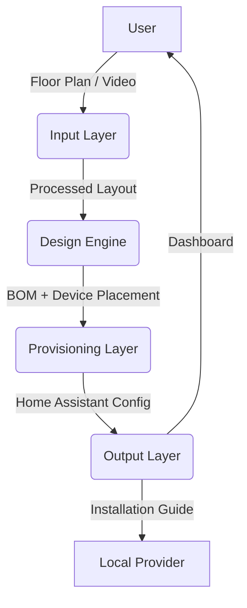

# Architecture Overview

## High-Level Design
The **Home Automation Design Service (HADS)** is a modular system composed of four primary layers:

1. **Input Layer**: Captures home layouts via interactive floor plans or video walkthroughs.
2. **Design Engine**: Generates device layouts, BOMs, and provider matches using AI.
3. **Provisioning Layer**: Configures Home Assistant and provisions devices.
4. **Output Layer**: Delivers installation guides, dashboards, and maintenance plans.

---

## Component Diagram

---

## Input Layer
### Components
1. **Web Interface**:
   - Interactive floor plan editor (React + Konva).
   - Video upload and processing.
   - User preferences form.
2. **Video Processing (Phase 2)**:
   - **Local-First Design**: Prioritizes local tools (COLMAP, OpenCV, ffmpeg) over cloud dependencies.
   - **Video Reconstruction**: Automated frame extraction and 3D reconstruction using the local toolchain.
   - **External Tool Integration**: Plug-and-play support for local `colmap`, `ffmpeg`, and `python3`/`opencv` executables.
   - **Deterministic Fallback**: Gracefully falls back to the deterministic MVP when native tools are unavailable to ensure CI/CD and developer environment stability.
   - **Feature Extraction**: Detects architectural features (walls, doors, windows) from reconstructions or Vital Camp exports.
   - **Enhanced Device Placement**: Context-aware recommendations for cameras, sensors, and switches based on detected features.
   - **BOM Generation**: Automated Bill of Materials with unit costs, quantities, and priority-aware line items.

### Workflow
1. User uploads a floor plan or video walkthrough.
2. System processes the input to generate a 3D layout.
3. User validates and adjusts the layout.

---

## Design Engine
### Components
1. **AI Layout Generator**:
   - Converts layouts into device placement plans.
   - Uses ML models to recommend optimal device locations.
2. **BOM Generator**:
   - Generates a list of required hardware.
   - Cross-references with user preferences (budget, brands).
3. **Provider Matching**:
   - Contracts local providers for installation and touch labor.

### Workflow
1. AI analyzes the layout to recommend device placement.
2. BOM is generated based on the layout and user preferences.
3. Local providers are matched for installation.

---

## Provisioning Layer
### Components
1. **Home Assistant Integration**:
   - Auto-generates YAML configurations.
   - Supports add-ons (Zigbee2MQTT, ESPHome).
2. **Device Provisioning**:
   - Automates device pairing (Zigbee, Z-Wave, Wi-Fi).
   - Generates setup guides for devices.
3. **Dashboard Setup**:
   - Pre-configured Home Assistant dashboards.
   - Customizable themes and layouts.

### Workflow
1. Home Assistant is configured with the generated layout and BOM.
2. Devices are provisioned and paired.
3. Dashboards are generated for user control.

---

## Output Layer
### Components
1. **Installation Guide**:
   - Step-by-step instructions for local providers.
   - Wiring diagrams and device placement maps.
2. **User Dashboard**:
   - Pre-configured Home Assistant dashboard.
   - Mobile and desktop support.
3. **Maintenance Plan**:
   - Automated alerts for device failures or updates.

### Workflow
1. Installation guides are generated for local providers.
2. User dashboards are delivered to homeowners.
3. Maintenance plans are set up for ongoing support.